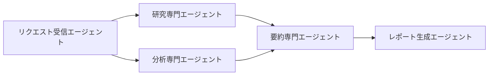

## AIエージェント時代のプロトコル選択

AIエージェント開発に携わっていると、「どのプロトコルを選ぶべきか」という悩みに直面します。2026年現在、**MCP（Model Context Protocol）**と**A2A（Agent-to-Agent Protocol）**という2つの標準が台頭していますが、実は用途が全く異なります。

この記事では、実装経験をもとに両プロトコルの技術的特徴と使い分けを解説します。

## MCPの技術的本質：外部システム統合プロトコル

MCPは「AIエージェントが外部ツールやデータベースにアクセスするための標準化されたインターフェース」です。

### MCPの基本実装パターン

```typescript
// MCPサーバーの基本実装
import { Server } from '@modelcontextprotocol/sdk/server/index.js';
import { StdioServerTransport } from '@modelcontextprotocol/sdk/server/stdio.js';

class DatabaseMCPServer {
  private server: Server;
  
  constructor() {
    this.server = new Server({
      name: 'database-connector',
      version: '1.0.0'
    }, {
      capabilities: {
        tools: {},
        resources: {}
      }
    });
    
    this.setupToolHandlers();
  }
  
  private setupToolHandlers() {
    // データベース検索ツール
    this.server.setRequestHandler(CallToolRequestSchema, async (request) => {
      const { name, arguments: args } = request.params;
      
      if (name === 'query_database') {
        const results = await this.queryDatabase(args.sql);
        return {
          content: [{
            type: 'text',
            text: JSON.stringify(results, null, 2)
          }]
        };
      }
      
      throw new Error(`Unknown tool: ${name}`);
    });
  }
  
  private async queryDatabase(sql: string) {
    // 実際のDB接続とクエリ実行
    return { rows: [], columns: [] };
  }
}
```

### MCPが解決する課題

従来、各AIツールは独自の方法で外部システムと連携していました。MCPにより：

- **統一インターフェース**: 1つのMCPサーバーを書けば、Claude、ChatGPT、Copilotすべてで利用可能
- **開発効率**: ツール特有の実装が不要
- **保守性**: APIの変更は1箇所のみで対応

## A2Aの技術的本質：エージェント間協調プロトコル

A2Aは「複数のAIエージェントが協調してタスクを実行するための通信規格」です。

### A2Aの実装例

```python
# A2Aエージェントカード定義
from a2a_protocol import AgentCard, RemoteAgent

class ResearchAgent:
    def __init__(self):
        self.card = AgentCard(
            name="research-specialist",
            version="1.0",
            capabilities={
                "web_search": {"input": "query", "output": "search_results"},
                "summarize": {"input": "documents", "output": "summary"}
            },
            endpoint="https://api.example.com/research-agent"
        )
    
    async def handle_task(self, task_type: str, payload: dict):
        if task_type == "web_search":
            # 検索処理の実装
            return await self.search_web(payload["query"])
        elif task_type == "summarize":
            # 要約処理の実装
            return await self.create_summary(payload["documents"])

class AnalysisAgent:
    def __init__(self):
        self.research_agent = RemoteAgent("research-specialist")
    
    async def analyze_topic(self, topic: str):
        # 研究エージェントに検索を委譲
        search_results = await self.research_agent.call(
            "web_search", 
            {"query": topic}
        )
        
        # 自身で分析実行
        analysis = await self.perform_analysis(search_results)
        return analysis
```

### A2Aが可能にするアーキテクチャ



各エージェントが専門性を持ち、必要に応じて他のエージェントに作業を委譲できます。

## 実装戦略：段階的アプローチ

### フェーズ1：MCPによる基盤構築

まずは単一エージェントにツールアクセス能力を付与します。

```typescript
// 開発環境向けMCPサーバー
class DevToolsMCPServer {
  constructor() {
    this.setupTools([
      'github_api',      // GitHub操作
      'slack_api',       // Slack通知
      'database_query',  // DB操作
      'file_operations'  // ファイル読み書き
    ]);
  }
}
```

### フェーズ2：A2Aによるマルチエージェント化

MCPで十分な能力を持ったエージェントを、A2Aで連携させます。

```python
class DevelopmentWorkflow:
    def __init__(self):
        self.code_agent = RemoteAgent("code-specialist")    # MCPでGitHub連携
        self.test_agent = RemoteAgent("test-specialist")    # MCPでテスト実行
        self.deploy_agent = RemoteAgent("deploy-specialist") # MCPでCI/CD連携
    
    async def handle_feature_request(self, requirement: str):
        # コード生成
        code = await self.code_agent.call("generate_code", {
            "requirement": requirement
        })
        
        # テスト実行
        test_results = await self.test_agent.call("run_tests", {
            "code": code
        })
        
        # デプロイメント
        if test_results["passed"]:
            deployment = await self.deploy_agent.call("deploy", {
                "code": code,
                "environment": "staging"
            })
            
        return {"code": code, "tests": test_results, "deployment": deployment}
```

## パフォーマンス最適化のポイント

### MCPサーバーの最適化

```typescript
class OptimizedMCPServer {
  private connectionPool: any;
  private cache: Map<string, any>;
  
  constructor() {
    this.connectionPool = new DatabasePool();
    this.cache = new Map();
  }
  
  async handleToolCall(toolName: string, args: any) {
    // キャッシュ確認
    const cacheKey = `${toolName}:${JSON.stringify(args)}`;
    if (this.cache.has(cacheKey)) {
      return this.cache.get(cacheKey);
    }
    
    // コネクションプールを使用した効率的なDB接続
    const result = await this.connectionPool.execute(toolName, args);
    
    // 結果をキャッシュ
    this.cache.set(cacheKey, result);
    return result;
  }
}
```

### A2Aエージェント間通信の最適化

```python
class OptimizedA2AAgent:
    def __init__(self):
        self.session_pool = aiohttp.ClientSession()
        self.task_queue = asyncio.Queue()
    
    async def batch_call(self, agent_name: str, tasks: list):
        """複数タスクをバッチ処理で効率化"""
        tasks_coroutines = [
            self.call_remote_agent(agent_name, task) 
            for task in tasks
        ]
        return await asyncio.gather(*tasks_coroutines)
```

## 監視とデバッグ

実際の開発では、プロトコル通信の可視化が重要です。

```typescript
// MCPサーバーの監視機能
class MonitoredMCPServer extends MCPServer {
  private metrics: MetricsCollector;
  
  async handleRequest(request: any) {
    const startTime = Date.now();
    
    try {
      const result = await super.handleRequest(request);
      this.metrics.recordSuccess(request.method, Date.now() - startTime);
      return result;
    } catch (error) {
      this.metrics.recordError(request.method, error.message);
      throw error;
    }
  }
}
```

## まとめ

MCPとA2Aは役割が明確に分かれています：

- **MCP**: エージェント ↔ ツール・データの橋渡し
- **A2A**: エージェント ↔ エージェントの協調

実装戦略としては、まずMCPで各エージェントに「手足」を与え、その後A2Aで「チームワーク」を実現するのが効果的です。

この記事の詳しい内容は自社ブログに書いています。両プロトコルを適切に使い分けることで、スケーラブルなAIエージェントシステムが構築できます。

詳細な実装手順はこちら → https://nands.tech/posts/mcp-vs-a2a-ai-agent-protocols-2026