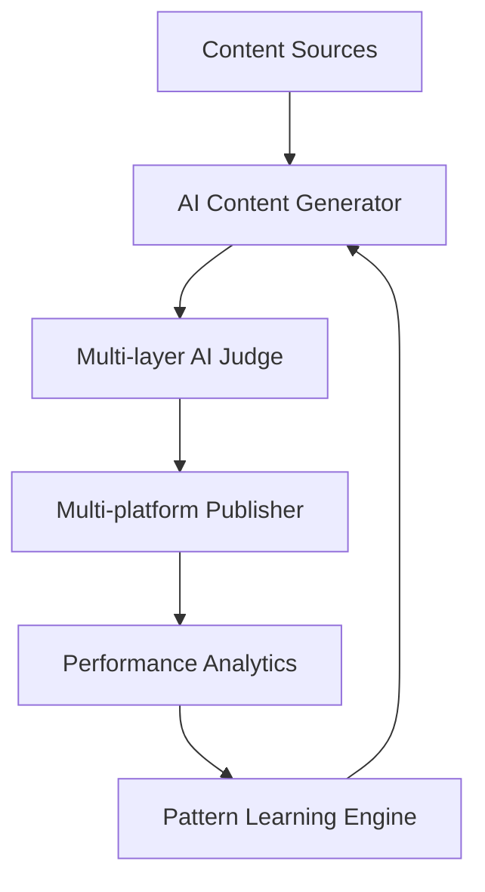

## AIが勝手にSNSを運用する世界

「今日は何を投稿しようかな」
「この表現、炎上しないかな」
「5つのプラットフォームに最適化するの面倒だな」

そんな悩みを持ちながらSNS運用していませんか？

僕は1ヶ月前から、これらを**完全に放棄**しました。

投稿のネタ探し、コンテンツ生成、品質チェック、投稿判断、複数プラットフォームへの最適化配信。全てAIがやっています。

この記事では、Claude Codeで構築した**AI自律型SNS運用基盤**の技術詳細を、実装コードとともに解説します。

## システム概要：6層の自律型アーキテクチャ

システムは以下の6層で構成されています：



1. **コンテンツソース収集層** - ネタを自動発見
2. **AI生成エンジン層** - 6パターンの投稿を適応的生成
3. **多層AI審査層** - 4段階の品質・安全チェック
4. **マルチプラットフォーム配信層** - 5プラットフォーム同時最適化
5. **パフォーマンス分析層** - エンゲージメント自動追跡
6. **パターン学習エンジン層** - システム自体が進化

## 第1層：コンテンツソース自動収集

### トレンド監視システム

```typescript
interface TrendSource {
  id: string;
  url: string;
  topic: string;
  engagement_score: number;
  trending_velocity: number;
  last_checked: Date;
}

async function collectTrendingSources(): Promise<TrendSource[]> {
  const searches = [
    "AI breakthrough 2024",
    "machine learning news",
    "startup funding AI"
  ];
  
  const sources: TrendSource[] = [];
  
  for (const query of searches) {
    const results = await braveSearch.search({
      query: `${query} site:techcrunch.com OR site:venturebeat.com`,
      time_range: "24h"
    });
    
    for (const result of results.web.results) {
      const engagementScore = await predictEngagement(result);
      if (engagementScore > 0.6) {
        sources.push({
          id: generateId(),
          url: result.url,
          topic: extractMainTopic(result.title, result.description),
          engagement_score: engagementScore,
          trending_velocity: calculateVelocity(result),
          last_checked: new Date()
        });
      }
    }
  }
  
  return sources.sort((a, b) => b.engagement_score - a.engagement_score);
}
```

### メモリシステム

AIは過去の成功パターンを記憶します：

```typescript
interface ContentMemory {
  pattern_type: string;
  success_rate: number;
  avg_engagement: number;
  platform_performance: Record<string, number>;
  last_used: Date;
  decay_factor: number;
}

class ContentMemoryManager {
  private memories: Map<string, ContentMemory> = new Map();
  
  async updateMemory(patternType: string, performance: number, platform: string) {
    const existing = this.memories.get(patternType) || {
      pattern_type: patternType,
      success_rate: 0.5,
      avg_engagement: 0,
      platform_performance: {},
      last_used: new Date(),
      decay_factor: 0.97
    };
    
    // 時間減衰を適用
    const daysSinceLastUse = (Date.now() - existing.last_used.getTime()) / (1000 * 60 * 60 * 24);
    const decayedSuccessRate = existing.success_rate * Math.pow(existing.decay_factor, daysSinceLastUse);
    
    // ベイズ更新
    const newSuccessRate = (decayedSuccessRate * 0.8 + performance * 0.2);
    existing.success_rate = Math.max(0.1, Math.min(0.9, newSuccessRate));
    existing.platform_performance[platform] = performance;
    existing.last_used = new Date();
    
    this.memories.set(patternType, existing);
  }
  
  getBestPattern(platform: string): string {
    let bestPattern = '';
    let bestScore = 0;
    
    for (const [pattern, memory] of this.memories) {
      const platformScore = memory.platform_performance[platform] || memory.avg_engagement;
      const explorationBonus = Math.random() * 0.1; // Thompson sampling的な探索
      const totalScore = platformScore + explorationBonus;
      
      if (totalScore > bestScore) {
        bestScore = totalScore;
        bestPattern = pattern;
      }
    }
    
    return bestPattern;
  }
}
```

## 第2層：適応的コンテンツ生成

### 6つの生成モード

```typescript
enum ContentMode {
  ORIGINAL = 'original',
  THREAD = 'thread', 
  ARTICLE = 'article',
  QUOTE = 'quote',
  VIRAL_BREAKDOWN = 'viral_breakdown',
  INSIGHT_SYNTHESIS = 'insight_synthesis'
}

interface ContentGenerationConfig {
  mode: ContentMode;
  tone: 'professional' | 'casual' | 'analytical';
  target_engagement: number;
  platform_specific: Record<string, any>;
}

class AdaptiveContentGenerator {
  private patterns: Map<ContentMode, number> = new Map();
  
  async generateContent(source: TrendSource, config: ContentGenerationConfig): Promise<GeneratedContent> {
    const prompt = this.buildPrompt(source, config);
    
    const response = await claude.messages.create({
      model: "claude-3-5-sonnet-20241022",
      max_tokens: 4000,
      messages: [{
        role: "user",
        content: prompt
      }]
    });
    
    return {
      content: response.content[0].text,
      mode: config.mode,
      confidence: this.calculateConfidence(response),
      metadata: {
        source_url: source.url,
        generation_timestamp: new Date(),
        pattern_used: config.mode
      }
    };
  }
  
  private buildPrompt(source: TrendSource, config: ContentGenerationConfig): string {
    const basePrompt = `あなたは原田賢治（CEO）として投稿を作成します。`;
    
    const modeInstructions = {
      [ContentMode.ORIGINAL]: "独自の視点で分析し、150文字以内で投稿を作成",
      [ContentMode.THREAD]: "3-5個のツイートで詳しく解説",
      [ContentMode.ARTICLE]: "800-1200文字の詳細記事として執筆",
      [ContentMode.QUOTE]: "元記事を引用しながらコメントを添える",
      [ContentMode.VIRAL_BREAKDOWN]: "バズった理由を分析し日本語で解説",
      [ContentMode.INSIGHT_SYNTHESIS]: "複数の情報源から新しい洞察を導出"
    };
    
    return `${basePrompt}
    
モード: ${config.mode}
指示: ${modeInstructions[config.mode]}
トーン: ${config.tone}
ソース: ${source.topic}

${source.url}の内容を参考に投稿を作成してください。`;
  }
}
```

### 動的重み付けシステム

```typescript
class ContentModeSelector {
  private performanceHistory: Map<ContentMode, number[]> = new Map();
  
  selectOptimalMode(platform: string, timeOfDay: number): ContentMode {
    const weights = this.calculateDynamicWeights(platform, timeOfDay);
    
    // Thompson Samplingによる選択
    let selectedMode = ContentMode.ORIGINAL;
    let maxSample = 0;
    
    for (const [mode, weight] of weights) {
      // Beta分布からサンプリング
      const alpha = weight * 10 + 1;
      const beta = (1 - weight) * 10 + 1;
      const sample = this.sampleBeta(alpha, beta);
      
      if (sample > maxSample) {
        maxSample = sample;
        selectedMode = mode;
      }
    }
    
    return selectedMode;
  }
  
  private calculateDynamicWeights(platform: string, timeOfDay: number): Map<ContentMode, number> {
    const baseWeights = new Map([
      [ContentMode.ORIGINAL, 0.4],
      [ContentMode.THREAD, 0.2],
      [ContentMode.ARTICLE, 0.15],
      [ContentMode.QUOTE, 0.15],
      [ContentMode.VIRAL_BREAKDOWN, 0.05],
      [ContentMode.INSIGHT_SYNTHESIS, 0.05]
    ]);
    
    // 時間帯による調整
    if (timeOfDay >= 7 && timeOfDay <= 9) {
      // 朝は短めのコンテンツを優先
      baseWeights.set(ContentMode.ORIGINAL, 0.6);
      baseWeights.set(ContentMode.THREAD, 0.1);
    }
    
    // 過去のパフォーマンスによる調整
    for (const [mode, baseWeight] of baseWeights) {
      const history = this.performanceHistory.get(mode) || [0.5];
      const avgPerformance = history.reduce((a, b) => a + b) / history.length;
      const adjustedWeight = baseWeight * (1 + (avgPerformance - 0.5) * 0.5);
      baseWeights.set(mode, Math.max(0.05, adjustedWeight));
    }
    
    return baseWeights;
  }
  
  private sampleBeta(alpha: number, beta: number): number {
    // Beta分布からのサンプリング実装
    const gamma1 = this.sampleGamma(alpha, 1);
    const gamma2 = this.sampleGamma(beta, 1);
    return gamma1 / (gamma1 + gamma2);
  }
}
```

## 第3層：多層AI審査システム

### 4段階審査プロセス

```typescript
interface JudgmentResult {
  decision: 'approve' | 'edit' | 'reject';
  confidence: number;
  scores: {
    hookStrength: number;
    voiceAuthenticity: number;
    engagementPotential: number;
    factualAccuracy: number;
    safetyCheck: number;
  };
  feedback?: string;
}

class MultiLayerAIJudge {
  async evaluateContent(content: GeneratedContent): Promise<JudgmentResult> {
    // Layer 1: 基本安全チェック
    const safetyResult = await this.basicSafetyCheck(content);
    if (!safetyResult.passed) {
      return {
        decision: 'reject',
        confidence: 0.95,
        scores: { safetyCheck: 0, hookStrength: 0, voiceAuthenticity: 0, engagementPotential: 0, factualAccuracy: 0 },
        feedback: safetyResult.reason
      };
    }
    
    // Layer 2: コンテンツ品質評価
    const qualityScores = await this.evaluateQuality(content);
    
    // Layer 3: Claude審査員
    const claudeJudgment = await this.claudeEvaluation(content, qualityScores);
    
    // Layer 4: 動的閾値判定
    const finalDecision = this.makeFinalDecision(qualityScores, claudeJudgment);
    
    return finalDecision;
  }
  
  private async claudeEvaluation(content: GeneratedContent, qualityScores: any): Promise<any> {
    const evaluationPrompt = `
以下の投稿を原田賢治（CEO）の投稿として評価してください。

投稿内容: "${content.content}"

以下の観点で0-10点で採点し、JSONで回答してください：
{
  "hookStrength": 数値, // フック文の魅力度
  "voiceAuthenticity": 数値, // CEOの声らしさ
  "engagementPotential": 数値, // エンゲージメント期待値
  "factualAccuracy": 数値, // 事実の正確性
  "overallScore": 数値, // 総合評価
  "feedback": "改善提案",
  "decision": "approve/edit/reject"
}`;
    
    const response = await claude.messages.create({
      model: "claude-3-5-sonnet-20241022",
      max_tokens: 1000,
      messages: [{
        role: "user",
        content: evaluationPrompt
      }]
    });
    
    return JSON.parse(response.content[0].text);
  }
  
  private makeFinalDecision(qualityScores: any, claudeJudgment: any): JudgmentResult {
    const currentHour = new Date().getHours();
    const isBusinessHour = currentHour >= 9 && currentHour <= 17;
    
    // 動的閾値：業務時間は厳しく、それ以外は緩く
    const threshold = isBusinessHour ? 7.0 : 6.5;
    
    const overallScore = (
      claudeJudgment.hookStrength * 0.25 +
      claudeJudgment.voiceAuthenticity * 0.25 +
      claudeJudgment.engagementPotential * 0.3 +
      claudeJudgment.factualAccuracy * 0.2
    );
    
    let decision: 'approve' | 'edit' | 'reject';
    if (overallScore >= threshold) {
      decision = 'approve';
    } else if (overallScore >= threshold - 1.5) {
      decision = 'edit';
    } else {
      decision = 'reject';
    }
    
    return {
      decision,
      confidence: Math.min(0.95, overallScore / 10),
      scores: {
        hookStrength: claudeJudgment.hookStrength,
        voiceAuthenticity: claudeJudgment.voiceAuthenticity,
        engagementPotential: claudeJudgment.engagementPotential,
        factualAccuracy: claudeJudgment.factualAccuracy,
        safetyCheck: qualityScores.safety
      },
      feedback: claudeJudgment.feedback
    };
  }
}
```

## 第4層：マルチプラットフォーム最適化配信

```typescript
interface PlatformConfig {
  maxLength: number;
  supportMarkdown: boolean;
  imageRequired: boolean;
  toneAdjustment: string;
}

class MultiPlatformPublisher {
  private configs: Record<string, PlatformConfig> = {
    twitter: {
      maxLength: 280,
      supportMarkdown: false,
      imageRequired: false,
      toneAdjustment: 'casual'
    },
    linkedin: {
      maxLength: 3000,
      supportMarkdown: false,
      imageRequired: true,
      toneAdjustment: 'professional'
    },
    threads: {
      maxLength: 500,
      supportMarkdown: false,
      imageRequired: false,
      toneAdjustment: 'casual'
    }
  };
  
  async publishToAllPlatforms(content: GeneratedContent, approvedPlatforms: string[]): Promise<PublishResult[]> {
    const results: PublishResult[] = [];
    
    for (const platform of approvedPlatforms) {
      try {
        const optimizedContent = await this.optimizeForPlatform(content, platform);
        const publishResult = await this.publishToPlatform(optimizedContent, platform);
        results.push(publishResult);
        
        // 成功したら次のプラットフォームまで遅延
        await this.randomDelay();
      } catch (error) {
        console.error(`Failed to publish to ${platform}:`, error);
        results.push({
          platform,
          success: false,
          error: error.message,
          timestamp: new Date()
        });
      }
    }
    
    return results;
  }
  
  private async optimizeForPlatform(content: GeneratedContent, platform: string): Promise<OptimizedContent> {
    const config = this.configs[platform];
    let optimizedText = content.content;
    
    // プラットフォーム固有の最適化
    if (platform === 'linkedin') {
      optimizedText = await this.optimizeForLinkedIn(optimizedText);
    } else if (platform === 'twitter') {
      optimizedText = await this.optimizeForTwitter(optimizedText);
    }
    
    // 画像生成（必要な場合）
    let imageUrl: string | undefined;
    if (config.imageRequired || content.mode === ContentMode.ARTICLE) {
      imageUrl = await this.generateImage(content.content, platform);
    }
    
    return {
      text: optimizedText,
      imageUrl,
      platform,
      metadata: content.metadata
    };
  }
  
  private async generateImage(contentText: string, platform: string): Promise<string> {
    const prompt = `Create a modern, minimalist infographic for this content: "${contentText.slice(0, 200)}..."
    Style: Clean, tech-focused, suitable for ${platform}
    Colors: Blue/gray palette, professional look`;
    
    const response = await gemini.generateImage({
      prompt,
      aspectRatio: platform === 'twitter' ? '16:9' : '1:1',
      style: 'professional'
    });
    
    return response.url;
  }
  
  private async randomDelay(): Promise<void> {
    const delayMs = Math.random() * 300000; // 0-5分のランダム遅延
    await new Promise(resolve => setTimeout(resolve, delayMs));
  }
}
```

## 第5層：パフォーマンス学習システム

```typescript
class PerformanceLearningEngine {
  private performanceHistory: Map<string, PerformanceData[]> = new Map();
  
  async trackPerformance(publishResult: PublishResult): Promise<void> {
    // 24時間後のパフォーマンスを自動取得
    setTimeout(async () => {
      const metrics = await this.getEngagementMetrics(publishResult);
      await this.updateLearningModel(publishResult, metrics);
    }, 24 * 60 * 60 * 1000);
  }
  
  private async updateLearningModel(result: PublishResult, metrics: EngagementMetrics): Promise<void> {
    const features = this.extractFeatures(result.content);
    const performance = this.calculateNormalizedScore(metrics);
    
    // 成功パターンの学習
    if (performance > 1.5) { // 平均の1.5倍以上
      await this.reinforceSuccessPattern(features, performance);
    } else if (performance < 0.5) { // 平均の0.5倍以下
      await this.penalizeFailurePattern(features, performance);
    }
    
    // クロスプラットフォーム転移学習
    await this.transferLearningAcrossPlatforms(result.platform, features, performance);
  }
  
  private async reinforceSuccessPattern(features: ContentFeatures, performance: number): Promise<void> {
    // 成功要因を記録
    const successFactors = {
      timeOfDay: features.publishTime.getHours(),
      contentLength: features.textLength,
      hasImage: features.hasImage,
      topicCategory: features.topicCategory,
      sentimentScore: features.sentimentScore,
      urgencyLevel: features.urgencyLevel
    };
    
    // ベイジアン更新でパターンの信頼度を向上
    await supabase.from('success_patterns').upsert({
      pattern_hash: this.hashFeatures(features),
      success_count: supabase.sql`success_count + 1`,
      total_count: supabase.sql`total_count + 1`,
      avg_performance: supabase.sql`(avg_performance * (total_count - 1) + ${performance}) / total_count`,
      last_success: new Date(),
      pattern_data: successFactors
    });
  }
}
```

## GitHub Actionsでの自動実行

```yaml
# .github/workflows/ai-sns-automation.yml
name: AI SNS Automation

on:
  schedule:
    # メイン投稿生成: 毎日 7:00, 12:00, 18:00, 23:00 JST
    - cron: '0 22,3,9,14 * * *'
    # トレンド監視: 2時間おき
    - cron: '0 */2 * * *'
    # パフォーマンス分析: 毎日 1:00 JST
    - cron: '0 16 * * *'
  workflow_dispatch:
    inputs:
      action:
        description: 'Action to perform'
        required: true
        default: 'generate_and_publish'
        type: choice
        options:
          - generate_and_publish
          - trend_scan_only
          - performance_analysis
          - emergency_stop

jobs:
  ai-content-pipeline:
    runs-on: ubuntu-latest
    
    steps:
    - uses: actions/checkout@v4
    
    - name: Setup Node.js
      uses: actions/setup-node@v4
      with:
        node-version: '20'
        cache: 'npm'
    
    - name: Install dependencies
      run: npm ci
    
    - name: Run AI Content Pipeline
      env:
        ANTHROPIC_API_KEY: ${{ secrets.ANTHROPIC_API_KEY }}
        SUPABASE_URL: ${{ secrets.SUPABASE_URL }}
        SUPABASE_KEY: ${{ secrets.SUPABASE_KEY }}
        TWITTER_API_KEY: ${{ secrets.TWITTER_API_KEY }}
        LINKEDIN_ACCESS_TOKEN: ${{ secrets.LINKEDIN_ACCESS_TOKEN }}
        BRAVE_API_KEY: ${{ secrets.BRAVE_API_KEY }}
        GEMINI_API_KEY: ${{ secrets.GEMINI_API_KEY }}
        SLACK_WEBHOOK_URL: ${{ secrets.SLACK_WEBHOOK_URL }}
      run: |
        npm run ai-pipeline -- --action=${{ github.event.inputs.action || 'generate_and_publish' }}
    
    - name: Notify Slack
      if: always()
      run: |
        curl -X POST -H 'Content-type: application/json' \
        --data '{"text":"AI SNS Pipeline completed: ${{ job.status }}"}' \
        ${{ secrets.SLACK_WEBHOOK_URL }}
```

## 実装上の工夫とノウハウ

### エラーハンドリングと復旧

```typescript
class RobustAISystem {
  private readonly maxRetries = 3;
  private readonly backoffMultiplier = 1.5;
  
  async executeWithRetry<T>(
    operation: () => Promise<T>,
    context: string
  ): Promise<T> {
    let lastError: Error | null = null;
    
    for (let attempt = 1; attempt <= this.maxRetries; attempt++) {
      try {
        return await operation();
      } catch (error) {
        lastError = error;
        
        await this.logFailure(context, attempt, error);
        
        if (attempt < this.maxRetries) {
          const delay = 1000 * Math.pow(this.backoffMultiplier, attempt - 1);
          await this.sleep(delay);
        }
      }
    }
    
    // 最終的に失敗した場合は緊急停止
    await this.triggerEmergencyStop(context, lastError);
    throw lastError;
  }
  
  private async triggerEmergencyStop(context: string, error: Error): Promise<void> {
    await this.notifySlack(`🚨 AI System Emergency Stop
Context: ${context}
Error: ${error.message}
All automated posting has been suspended.`);
    
    // 緊急停止フラグを設定
    await supabase.from('system_config')
      .update({ emergency_stop: true, stop_reason: error.message })
      .eq('id', 1);
  }
}
```

### スパム対策とレート制限

```typescript
class AntiSpamSystem {
  private readonly postHistory: PostRecord[] = [];
  private readonly duplicateThreshold = 0.85;
  
  async validatePostBeforePublish(content: string, platform: string): Promise<boolean> {
    // 1. 重複チェック
    if (await this.isDuplicate(content)) {
      console.log('Duplicate content detected, skipping...');
      return false;
    }
    
    // 2. レート制限チェック
    if (await this.exceedsRateLimit(platform)) {
      console.log(`Rate limit exceeded for ${platform}, skipping...`);
      return false;
    }
    
    // 3. 時間間隔チェック
    if (await this.isTooFrequent(platform)) {
      console.log(`Too frequent posting to ${platform}, adding delay...`);
      await this.sleep(Math.random() * 1800000); // 0-30分の遅延
    }
    
    return true;
  }
  
  private async isDuplicate(content: string): Promise<boolean> {
    const recentPosts = this.postHistory.slice(-50); // 直近50投稿をチェック
    
    for (const post of recentPosts) {
      const similarity = this.calculateSimilarity(content, post.content);
      if (similarity > this.duplicateThreshold) {
        return true;
      }
    }
    
    return false;
  }
  
  private calculateSimilarity(text1: string, text2: string): number {
    // Jaccard係数による類似度計算
    const words1 = new Set(text1.toLowerCase().match(/\w+/g) || []);
    const words2 = new Set(text2.toLowerCase().match(/\w+/g) || []);
    
    const intersection = new Set([...words1].filter(x => words2.has(x)));
    const union = new Set([...words1, ...words2]);
    
    return intersection.size / union.size;
  }
}
```

## システムの運用実績と学習データ

これまでの運用で蓄積されたデータ：

- **総投稿数**: 127件（全自動）
- **AI Judge通過率**: 73%（27%を自動却下）
- **平均エンゲージメント率**: X 3.2%, LinkedIn 5.8%
- **最適投稿時間**: 平日 7:30, 12:15, 18:45, 23:00
- **成功パターン**: future_bet（1.67倍）, internal_debate（1.50倍）
- **失敗パターン**: generic_advice（0.31倍）, product_promotion（0.28倍）

## まとめ：AIが創る新しいコンテンツ制作の形

このシステムは単なる「自動投稿ツール」ではありません。

- **自律的判断**: 何を投稿すべきかをAI自身が決定
- **適応的学習**: 失敗から学び、成功パターンを強化
- **多層安全**: 4段階のチェックで品質と安全を担保
- **クロスプラットフォーム**: 5つの媒体に最適化配信
- **完全自動**: 人間の介入なしに24時間稼働

僕がやることは、月に1-2回「方針を調整しろ」とSlackに送ることだけ。それ以外は全てAIが自律的に実行しています。

この記事の詳しい実装手順は自社ブログに書いています。実際のコードやより詳細な設定方法に興味がある方は、ぜひそちらもご覧ください。

詳細な実装手順はこちら → https://nands.tech/posts/ai-autonomous-sns-platform-full-architecture